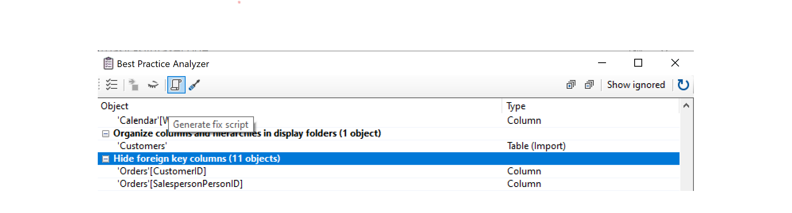
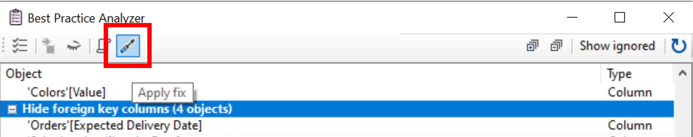

# An Introduction to Tabular Editor


### About:
Tabular Editor provides an intuitive hierarchical view of every object in your Tabular Model metadata. Columns, Measures and Hierarchies are arranged in Display Folders by default. You can edit properties of one or more objects, by (multi)selecting them in the tree. A DAX Editor with syntax highlighting lets you easily edit the expressions of Measures, Calculated Columns and Calculated Tables.

Website: https://tabulareditor.com/
___

**Follow Along:**
- [Download and Install Tabular Editor](https://github.com/otykier/TabularEditor/releases)
- [Download and open the Sales Demo PBIX File](https://github.com/itsnotaboutthecell/Power-BI-Sessions/raw/master/An%20Introduction%20to%20Tabular%20Editor/Sales%20Demo.pbix)

___

# Tabular Object Model Hierarchy
**Source:** Microsoft Docs

The Tabular Object Model (TOM) exposes native tabular metadata, such as model, tables, columns, and relationships objects. A high-level view of the object model tree, provided below, illustrates how the component parts are related.


From a logical perspective, all tabular objects form a tree, the root of which is a Model, descended from Database. Server and Database are not considered tabular because these objects can also represent a multidimensional database hosted on a server running in Multidimensional mode, or a tabular model at a lower compatibility level that does not use tabular metadata for object definitions.

[Learn More](https://docs.microsoft.com/en-us/analysis-services/tom/introduction-to-the-tabular-object-model-tom-in-analysis-services-amo)

## Instructions
1. Ensure the Power BI preview feature [Store datasets using enhanced metadata format](https://docs.microsoft.com/en-us/power-bi/connect-data/desktop-enhanced-dataset-metadata) is enabled.
2. With the Sales Demo (PBIX) file open, navigate to the **External Tools** ribbon in Power BI Desktop and select **Tabular Editor**.
3. On your local machine create a folder titled: **Sales Demo**
4. Within Tabular Editor 
    1. Navigate to **File > Save to Folder...** and select the above **Sales Demo** that was created.
    2. Navigate to the **Sales Demo** folder and review the outputs in comparison with the TOM hierarchy above.
5. To view the full solution navigate to **File > Save As..** and save the output **model.bim** (bim: business intelligence model), to your local machine to review.

**Important Note:** The underlying **model.bim** file can now be incorporated into your CI/CD pipelines for deployments with Azure DevOps. To deploy changes directly to existing datasets published in the Power BI service, enabling the XMLA read/write endpoint in the capacity settings and Power BI Premium is required.

[Learn More About Data Modeling and Management Tools](https://docs.microsoft.com/en-us/power-bi/admin/service-premium-connect-tools#data-modeling-and-management-tools) 
___

# Best Practices Analyzer

### About:
The best practices rules are a collection of community contributions for Tabular Model development. They let you define global or model-specific rules using a simple expression language. At any time, you can check whether objects in your model satisfy the rules.

Website: https://github.com/TabularEditor/BestPracticeRules

## Instructions
1. Navigate to the repository, https://github.com/TabularEditor/BestPracticeRules
2. Navigate to the [BPARules-standard.json](https://github.com/TabularEditor/BestPracticeRules/blob/master/BPARules-standard.json) file and press the Raw button.
    1. Copy the web address in your browser (must match the below with the prefix raw) - 
    
    ``https://raw.githubusercontent.com/TabularEditor/BestPracticeRules/master/BPARules-standard.json``
4. Within Tabular Editor navigate to **Tools** and select **Manage BPA Rules...**
    1. Within the Manage Best Practice Rules dialog
        1. Press **Add..**
        2. Select **Include Rule File from URL** and press **OK**
        3. Paste the above BPARules-standard.json web address and press **OK**
5. Within Tabular Editor:
    1. Navigate to **Tools** and select **Best Practice Analyzer...** or press the hotkey (**F10**)
    2. Review the current list of objects needing attention based on the rules.
    3. Select the header **Hide foreign key columns (11 objects)**
    4. Press the **Generate fix script** icon to copy to the clipboard.
    
    5. In the **Fix script generation** dialog box prompt press **OK**.
6. Within Tabular Editor:
    1. Select the **Advanced Scripting** tab and paste the generated script (**Ctrl+V**) or from the navigation menu (**Edit > Paste**)
    2. Press the **Run script (selection only) F5** button. ▶
    3. Press the **Saves the changes to the connected database (Ctrl+S) button.**
    
7. Within Power BI Desktop
    1. Review the **Orders** table to confirm that all the applicable columns (CustomerID, SalesPersonID, Order Date and Expected Delivery Date) are now hidden.
    2. Right click any field and select **Unhide All**
8. Within Tabular Editor:
    1. In the **External change detected** dialog box press **Yes**
    1. Confirm that the fields hidden are now visible.
    2. Navigate to **Tools** and select **Best Practice Analyzer...** or press the hotkey (**F10**)
    3. Select the header **Hide foreign key columns (11 objects)**
    4. Press the **Apply fix** icon to instantly apply fixes.
    
    5. Press the **Saves the changes to the connected database (Ctrl+S) button.**

**Important Note:** Changes to the model can be both read from and written to the Power BI dataset. Any changes within Tabular Editor will need to be saved back to the connected database.

___

# Advanced Scripting (Automation)

Advanced Scripting, lets users write a script, to more directly manipulate the objects in the loaded Tabular Model, that can be saved as Custom Actions for easy invocation directly in the Explorer Tree.

Website: https://github.com/otykier/TabularEditor/wiki/Advanced-Scripting

Examples: https://github.com/otykier/TabularEditor/wiki/Useful-script-snippets

**Important Note:** 
- You can use CTRL+Z to undo or CTRL+Y to redo changes.
- The scripting language is C#

## Instructions

1. Select the **Advanced Scripting** tab and enter the below script
```
Selected.Table.AddMeasure( 
    "Total Count of " + Selected.Table.Name,
    "COUNTROWS('" + Selected.Table.Name + "')",
    "Measurements" 
);
```
**Best Practice:** Utilize a single quote in the event of a table name containing a space for the expression.

2. Select the **Orders** table and then press the **Run script (selection only) F5** button. ▶
3. Within the Model Explorer navigate to the **Orders** table, the **Measurements** folder and select the **Total Count of Orders** measure.
4. Review the following arguments from the script earlier in comparison with the Property Pages
```
Selected.Table.AddMeasure( 
    Argument1 // Name ,
    Argument2 // Expression ,
    Argument3 // Display Folder
);
```


5. Press **CTRL+Z** to undo actions until the folder and measure have been removed from the **Orders** table.
6. Within the **Advanced Scripting** tab update the script to include a variable
```
var tableName = Selected.Table.Name;

Selected.Table.AddMeasure(
    "Total Count of " + tableName,
    "COUNTROWS('" + tableName + "')",
    "Measurements"
);
```
7. Select the **Orders** table and then press the **Run script (selection only) F5** button. ▶
8. Confirm within the Model Explorer in the the **Orders** table and the **Measurements** folder the the **Total Count of Orders** measure exists.
9. Select the **Customers** and **Employees** table and press the **Run script (selection only) F5** button. ▶
10. An error will now be displayed stating **The selection contains more than one object of type Table** indicating only one active object can be selected.
11. Within the  **Advanced Scripting** tab select **Samples**, **Tutorials** and **Loop through all selected tables**

12. Update the script to include the below

```
foreach(var table in Selected.Tables) {
   
    var tableName = table.Name;
   
    table.AddMeasure(
        "Total Count of " + tableName,
        "COUNTROWS('" + tableName + "')",
        "Measurements"
    );
    
};
```
___

# Calculation Groups


___

# Optional Content

## Creating Partitions (Power BI Premium)

[Process Database, Table or Partition](https://docs.microsoft.com/en-us/analysis-services/tabular-models/process-database-table-or-partition-analysis-services)
